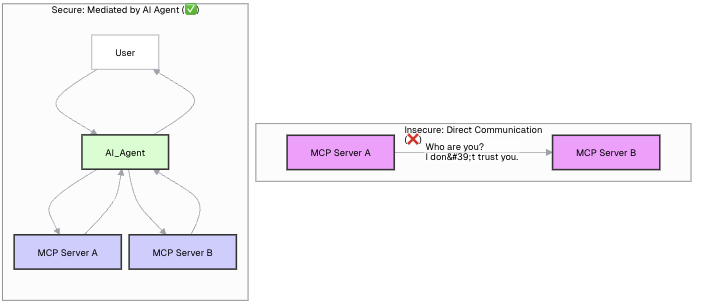

## Introduction: The Dream and the Danger

The vision of the Model Context Protocol (MCP) is exhilarating. We imagine a vibrant ecosystem where AI agents can seamlessly discover and use a universe of tools. An agent could query a weather service, book a flight, update a CRM, and manage a user's calendar, all by speaking a common language. It's a future of incredible power and automation.

But this dream has a shadow. As soon as these independent systems start talking to each other, a critical question emerges, one that separates a cool demo from a production-ready application: **How do we secure it?**

What stops a rogue agent from accessing your private data? How does a tool provider know who is making a request? Can two third-party tools start talking to each other without your knowledge?

This article tackles these questions head-on. We'll explore the essential security patterns for building a trustworthy, multi-party MCP ecosystem.

## The First Rule: Security Isn't "Baked In" (And That's a Good Thing)

A common first question is, "Is security already baked into the MCP SDKs?"

The answer is **no**, and this is by design. The MCP specification and its corresponding SDKs are intentionally _unopinionated_ about your security model. They define the _protocol_ for communication, not the _policy_ for access.

This is a feature, not a flaw. It provides the flexibility to integrate MCP into your existing security infrastructure, whether it's based on simple API keys, enterprise-grade OAuth 2.0, or a service mesh with mTLS.

The most important principle to internalize is this:

> **An MCP server is a web API. You must secure it with the same rigor you would apply to any other mission-critical API.**

All the battle-tested patterns of web security are not just relevant; they are required.

## The Two Pillars: Authentication vs. Authorization

Before diving into patterns, we must distinguish between two core concepts:

1.  **Authentication (AuthN): "Who are you?"** This is the process of verifying the identity of the client making the request. Is this a known, trusted application?
2.  **Authorization (AuthZ): "What are you allowed to do?"** Once a client is authenticated, this is the process of determining what specific actions or data they have permission to access. Can this user see tasks from `Project A` but not `Project B`?

With that foundation, let's look at the patterns.

## Pattern 1: API Keys for Server-to-Server Trust

This is the most straightforward pattern for securing communication between two backend services.

- **Use Case:** A third-party AI agent calling your MCP server, or your internal server calling another tool.
- **How it Works:** The MCP server owner generates a unique, secret API key for each client. The client must include this key in the `Authorization: Bearer <API_KEY>` header of every request. A middleware on the server validates this key before processing the request. If the key is missing or invalid, the server rejects the call with a `401 Unauthorized` status.

## Pattern 2: JWTs & OAuth 2.0 for User-Contextual Actions

This pattern is essential when an AI agent needs to act **on behalf of a specific user.**

- **Use Case:** A user logged into your application asks the AI to do something with _their_ personal data.
- **How it Works:**
  1.  A user logs into your application and receives a JSON Web Token (JWT) containing their user ID and permissions.
  2.  When your application calls its own backend (the MCP Host), it passes this JWT along.
  3.  Crucially, when the MCP Host calls an MCP Server to execute a tool, it **forwards the user's JWT**.
  4.  The MCP Server's middleware validates the JWT, extracts the user's identity, and makes it available to the tool logic.
  5.  The tool can now perform authorization checks. For example, a `get_tasks` tool would add a `WHERE owner_id = ?` clause to its database query, ensuring it only returns tasks belonging to the authenticated user.

## Can Two 3rd-Party Servers Talk to Each Other?

This brings us to a critical architectural question: If your agent trusts Server A and also trusts Server B, can A and B talk to each other directly?

The answer is an emphatic **no**. Direct, unauthenticated communication between two unknown servers is a massive security hole. Trust is not transitive.

The correct and secure architecture relies on a **central orchestrator**—your AI agent. The agent is the only entity that holds the credentials for both services and is responsible for mediating the entire workflow.

### The Secure Mediated Flow

1.  **Establish Trust:** Your AI agent is configured with API keys for both Server A (e.g., a weather service) and Server B (e.g., a calendar service).
2.  **Mediate the Call:** When a user asks a question that requires both tools, the agent performs a sequence of calls:
    - It first calls Server A, authenticating itself with API Key A.
    - It receives the result from Server A.
    - It then uses that result to call Server B, authenticating itself with API Key B.
3.  **Synthesize and Respond:** The agent gets the final result from Server B and provides a synthesized answer to the user.

At no point do Server A and Server B ever communicate directly. They don't know each other, and they don't need to. They only need to trust the authenticated requests coming from your agent.

This diagram illustrates the concept perfectly:

## Conclusion: Building a Trustworthy Ecosystem

The Model Context Protocol provides the blueprint for a new generation of interconnected AI applications. But this future can only be realized if we build it on a foundation of security and trust.

By treating MCP endpoints as the critical APIs they are and applying standard, robust security patterns, we can move beyond exciting demos to create a powerful, scalable, and—most importantly—secure AI agent ecosystem. The protocol gives us the language; it's our job to ensure the conversations are safe.
