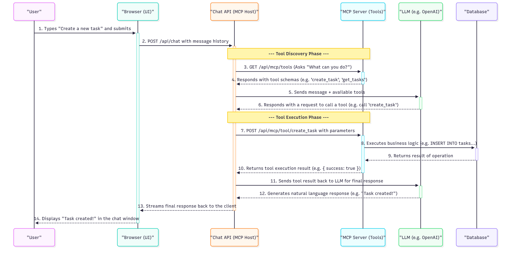

## Introduction

As full-stack developers, we stand at a thrilling and chaotic frontier. The rise of Large Language Models (LLMs) has unlocked capabilities we could only dream of a few years ago. We're building copilots, intelligent chatbots, and AI-powered workflows. Yet, amidst this innovation, a familiar growing pain has emerged: the "API jungle."

Connecting our applications to the powerful reasoning engines of LLMs often involves creating a tangled web of bespoke, one-off integrations. Each time we want our AI to talk to a new service—be it a database, a project management tool, or a third-party API—we build a custom adapter. This approach is brittle, difficult to maintain, and creates tight coupling between our application logic and the specific AI model we're using. What our industry has been missing is a standard, a universal language for AI tool use.

That standard is here, and it’s called the **Model Context Protocol (MCP)**. Think of it as HTTP for AI agents or USB-C for tool connectivity. It’s an open-source specification designed to create a universal interface between an AI application (the "host") and any external tool or data source (the "server"). By adopting this protocol, we can finally decouple our tools from our AI models, paving the way for a future of interoperable, secure, and truly autonomous agents.

## What is the Model Context Protocol (MCP)?

At its core, MCP is a simple yet powerful client-server protocol that standardizes how an AI host discovers and executes tools provided by a server. It’s built on the web technologies we already know and love, primarily HTTP and JSON.

The protocol defines three key players:

1.  **The MCP Host:** This is the AI application itself, the "brain" of the operation. It could be a chatbot like the one we'll build, an AI-powered IDE like Cursor, or any system that leverages an LLM to reason and act.
2.  **The MCP Client:** The host creates a client instance to communicate with a specific MCP server. This client handles the low-level details of the protocol.
3.  **The MCP Server:** This is any service that exposes its capabilities as "tools" according to the MCP specification. This could be a Vercel project exposing deployment information, a Supabase instance providing data access, or, in our case, a custom Next.js API.

The interaction is straightforward and elegant:

- **Discovery:** The client first asks the server, "What tools do you have?" by making a request to a standard `/tools` endpoint. The server responds with a list of available tools, including their names, descriptions, and input schemas.
- **Execution:** When the LLM decides to use a tool, the client makes a request to a `/tool/{tool_name}` endpoint, providing the necessary parameters in the request body. The server executes the tool's logic and returns the result.

This simple contract allows for incredible flexibility. Your server doesn't need to know anything about the LLM, and the LLM doesn't need to know anything about your server's internal implementation. They just need to speak the common language of MCP.

## A Practical Deep Dive: Building "Project Pal"

To see MCP in action, let's architect "Project Pal." The goal is to create an AI assistant that allows users to manage a project backlog using natural language commands like, "Create a high-priority task to fix the authentication bug," or "What tasks are currently in progress?"

The complete source code for this example application is available on GitHub: [https://github.com/devlinduldulao/mcp-example](https://github.com/devlinduldulao/mcp-example)

A naive approach might be to build a single, monolithic Next.js application where the chat API directly contains all the database logic. This works for a prototype, but it's a recipe for technical debt. A far more robust and scalable architecture, enabled by MCP, is to separate our concerns into two distinct services.

### The Architecture: The Toolbox and the Interface

The architecture separates the application into two main parts: a secure backend "toolbox" (the MCP Server) and a smart user "interface" (the MCP Client). This separation is key to building a secure and scalable AI application.



1.  **The MCP Server (`project-pal-api`): The Secure Toolbox**
    This is a headless Next.js application. It has no UI. Its only job is to be a secure gateway to our project data. It connects to our database and exposes a set of granular actions as MCP tools. This is our single source of truth for what the AI is _allowed_ to do.

2.  **The MCP Client (`project-pal-chat-ui`): The Smart Interface**
    This is the user-facing Next.js application, complete with a beautiful UI built with shadcn/ui and Tailwind CSS. This application is "dumb" about the business logic. It knows how to render a chat interface and how to talk to an LLM, but it has no idea how to create a task. It discovers its capabilities at runtime by talking to the MCP server.

### Inside the MCP Server

The core of our server is a single API route, `/api/mcp/route.ts`. We use the `@vercel/mcp-adapter` library to easily create a compliant server.

```typescript
// file: app/api/mcp/route.ts
import { z } from "zod";
import { createMcpHandler } from "@vercel/mcp-adapter";

// ... (mock database setup)

const handler = createMcpHandler(
  server => {
    // Tool to get a list of tasks
    server.tool(
      "get_tasks",
      "Gets a list of tasks from the project management system.",
      {
        status: z
          .enum(["todo", "in-progress", "done"])
          .optional()
          .describe("Filter tasks by status."),
      },
      async ({ status }) => {
        /* ... database logic ... */
      }
    );

    // Tool to create a new task
    server.tool(
      "create_task",
      "Creates a new task.",
      {
        title: z.string().describe("The title of the task."),
        priority: z.enum(["low", "medium", "high"]).default("medium"),
      },
      async ({ title, priority }) => {
        /* ... database logic ... */
      }
    );
  },
  {},
  { basePath: "/api" }
);

export { handler as GET, handler as POST, handler as DELETE };
```

Notice the use of Zod. This is critical. The Zod schema serves three purposes:

1.  **Runtime Validation:** It ensures that any data passed to our tool logic is of the correct type and shape.
2.  **Type Safety:** It provides static types for our tool's implementation.
3.  **LLM Instruction:** The `.describe()` calls are not just comments. The MCP adapter uses these descriptions to generate a detailed schema that tells the LLM exactly what the tool does and what each parameter means. This is prompt engineering at the protocol level.

### Inside the MCP Client

The client's chat API route, `/api/chat/route.ts`, orchestrates the interaction.

```typescript
// file: app/api/chat/route.ts
import { experimental_createMCPClient, streamText } from "ai";
import { openai } from "@ai-sdk/openai";
import { StreamableHTTPClientTransport } from "@modelcontextprotocol/sdk/client/streamableHttp.js";

export async function POST(req: Request) {
  const { messages } = await req.json();

  const mcpServerUrl = `${process.env.VERCEL_URL}/api/mcp`;
  const transport = new StreamableHTTPClientTransport(new URL(mcpServerUrl));
  const mcpClient = await experimental_createMCPClient({ transport });

  try {
    const tools = await mcpClient.tools(); // Step 1: Discover tools

    const result = await streamText({
      model: openai("gpt-4o"),
      messages,
      tools, // Step 2: Provide tools to the LLM
      onFinish: async () => {
        await mcpClient.close(); // Step 3: Clean up resources
      },
    });

    return result.toDataStreamResponse();
  } catch (error) {
    /* ... error handling ... */
  }
}
```

The workflow is clear: connect to the server, discover its tools, and pass them along with the user's message to the LLM. The Vercel AI SDK handles the complex parts of determining when the LLM wants to call a tool and executing it through the MCP client.

## Security in an AI-Powered World: Locking Down Your MCP Server

When you give an AI the ability to perform actions, security becomes paramount. The AI, for all its intelligence, must be treated as an untrusted, unpredictable actor. The MCP architecture provides a powerful framework for enforcing security.

### The Principle of Least Privilege

Your MCP server is your security boundary. The most important rule is to **never expose a generic, all-powerful tool**. A tool like `run_sql_query(query)` would be catastrophic. Instead, expose only granular, atomic actions like `create_task`. The LLM can reason about combining these safe, small tools to accomplish complex tasks.

### Authentication and Authorization

Your MCP server is an API, and it should be protected like one. You must implement authentication to ensure that only authorized clients can access your tools. For tools that need to act on behalf of a specific user, the client should pass the user's JWT to the MCP server. The server can then validate the token and apply user-specific permissions within the tool's logic.

### Robust Input Validation

We've already seen Zod in our tool definitions. Its role in security cannot be overstated. It acts as a final line of defense against prompt injection. Even if an attacker tricks the LLM into generating malicious or malformed JSON for a tool call, Zod will reject the input before it ever reaches your business logic.

### Rate Limiting and Cost Control

LLMs can be "chatty" and might decide to call a tool multiple times in a loop. To prevent abuse and control costs, you must implement rate limiting on your `/api/mcp` endpoint. Services like Upstash Redis are perfect for implementing sophisticated rate-limiting middleware in a serverless environment.

## Best Practices for Production-Ready MCP Implementations

Moving from a prototype to a production system requires discipline. Here are some best practices to follow:

- **Design Your Tools for the LLM:** Each tool should do one thing and do it well. The `name` and `description` of your tools and their parameters are your primary interface with the LLM. Be clear, concise, and unambiguous.
- **Implement Comprehensive Observability:** Log every single tool invocation. Record the tool name, the exact parameters it was called with, and the result it returned. This is invaluable for debugging.
- **Manage State and Conversation Context:** MCP itself is stateless. For conversations that require context (e.g., "Now, set the priority of _that task_ to high"), you need a strategy for managing state, such as passing a `conversation_id` to a session store like Redis or Vercel KV.

## The Future is Composable

The Model Context Protocol represents a fundamental shift in how we build AI-powered applications. It moves us away from a world of brittle, custom integrations and toward a future of composable, interoperable, and secure AI agents. By building on an open standard, we ensure that the tools we create today will be usable by the AI hosts of tomorrow.

For us as full-stack developers, this is an incredible opportunity. It provides a clear and robust pattern for bridging the gap between the powerful reasoning of LLMs and the practical, real-world actions our applications need to perform. By embracing protocols like MCP and adhering to strong security and design principles, we can move beyond simple chatbots and begin to build the next generation of truly autonomous and useful AI systems.
